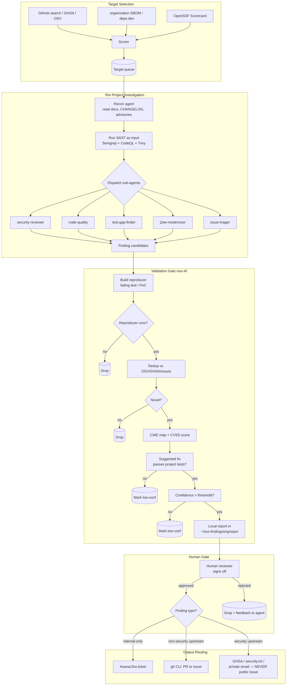

# OSS Bug-Hunting Agent — Research Brief & Prototype Design

*Author: research brief prepared for maintainer@example.com*
*Date: 2026-05-18*

---

## 1. TL;DR

- **Worth building? Conditionally yes — but only as a private, gated "internal-first" tool, never as an autonomous upstream reporter.** The technology is real (XBOW topped HackerOne in Q2 2025; Big Sleep caught a SQLite 0-day before in-the-wild exploitation; CodeMender shipped 72 OSS patches in six months), but the public OSS contribution channel is poisoned — curl, Python, React, and Apache Airflow have all been buried by AI slop and curl shut down its bug bounty in Feb 2026.
- **The killer risk is reputational.** If even a handful of organization-attributed AI-generated reports turn out to be slop, the engineer's GitHub identity (and by extension the organization's) is the target of public shaming. Daniel Stenberg has stated curl will "ban and ridicule publicly." This risk dominates all the technical risks combined.
- **The novel signal an agent provides is not "find bugs" — static scanners and fuzzers already do that.** The novel signal is *(a)* cross-file, hypothesis-driven exploration ("read the README and CVE history, then probe the code"), *(b)* automated exploit/PoC construction that validates the finding before a human ever sees it, and *(c)* triage-at-scale (clustering 500 stale issues, mapping deprecated J2EE APIs across an org's SBOM). Findings without a working reproducer should never leave the local report directory.
- **The mandatory architectural pattern is the XBOW/CodeMender one: agent proposes, *non-AI validators dispose.*** Every finding must clear an executable validator (PoC runs in a container, canary is exfiltrated, failing test demonstrates the bug, patch passes the project's own test suite) before it is even surfaced to the human reviewer, and a human reviewer must sign off before anything escapes the local box. No exceptions.
- **Start at Phase 0 with one project the user already knows deeply.** If the agent cannot produce one validated, novel finding on a project where the engineer can sanity-check it in a day, the rest of the plan is moot. Most of the value (internal risk assessment of OSS deps) is achievable in Phases 0-1 without ever talking to upstream.

---

## 2. Landscape — Existing Tools

### 2.1 SAST, SCA, and dependency scanners

| Tool | What it does well | Gap for agentic approach |
|---|---|---|
| **CodeQL** (GitHub) | Compiled DB enables real cross-file taint/dataflow; best-in-class for injection and authn-bypass classes; large community query library | Queries must be written by humans; cannot reason about business logic, intent, or natural-language artifacts (docs, CHANGELOG, threat model) |
| **Semgrep** | Pattern-matching fast and approachable; Pro engine adds cross-file taint (cites 50-71% more TPs vs CE) | CE is single-file only; doesn't reason about object-level semantics (HashMap key/value tracking breaks taint) |
| **Snyk / Trivy / Dependabot / Renovate** | SCA / SBOM diff against known CVE DBs; PR automation | Known-CVE-only — zero help for un-disclosed vulns |
| **SonarQube / Bandit / Brakeman / FindSecBugs** | Language-specific rule packs; mature CI integrations | Rule-based, high FP rates, no semantic understanding |
| **OpenSSF Scorecard / deps.dev / GUAC / SLSA / Sigstore** | Supply-chain posture signals — *excellent target-selection inputs* | Posture, not vulns; perfect as a scoring source for our target picker |
| **OSV / GHSA feeds** | Authoritative vuln database; structured | Lagging by definition; useful for dedup and as a "what's already known" gate |

### 2.2 Fuzzers

| Tool | Strength | Gap |
|---|---|---|
| **OSS-Fuzz** | Continuous fuzzing infra for ~1000+ OSS projects, Google-funded compute. Reports 26+ new vulns discovered using AI (incl. CVE-2024-9143 in OpenSSL) | Coverage and harness gaps — many libraries aren't fuzzed at all; harness authoring is the bottleneck (which is itself an LLM target) |
| **Jazzer** (Java), **Atheris** (Python), **libFuzzer / AFL++** | Production-grade coverage-guided fuzzing per language | Same — harness authoring, corpus seeding, and triage of crash output are the human-cost bottlenecks |
| **FuzzForge AI** | OSS platform for AI-driven fuzzing orchestration | Early development; demonstrates the design pattern |

### 2.3 Agentic SWE frameworks (the substrate)

| Framework | Notes |
|---|---|
| **SWE-agent** (Princeton) | Research-oriented Agent-Computer Interface; high SWE-bench scores |
| **OpenHands** (ex-OpenDevin) | OSS, enterprise-ready, multi-agent; ~72% on SWE-bench Verified |
| **Aider / Cursor BG agents / Copilot Workspace / Devin / Claude Code** | Developer-facing coding agents; building blocks, not bug-hunting frameworks |
| **SWE-EVO benchmark** (2026) | Long-horizon (avg 21 files/task) — even GPT-5 + OpenHands only resolves 21% (vs 65% on single-issue SWE-Bench). Important reality check: agents are *not* yet good at sustained multi-file engineering, which is exactly what serious bug-hunting demands. |

### 2.4 Agentic vulnerability research (closest prior art — the bar to clear)

| System | What it does | Lesson for us |
|---|---|---|
| **XBOW** | Autonomous offensive-security platform. **Q2 2025: topped HackerOne US leaderboard** with 1,000+ reports (54 critical, 242 high). Raised $75M (Series B). Famous "200 zero-days, zero false positives" result on 17,000+ DockerHub images. | *Validators sit outside the AI* — headless-browser executes the XSS payload; canary strings confirm admin compromise; PoC executes in per-job Docker. Human review of every submission before HackerOne. **This is the gold-standard pattern to copy.** |
| **Google Big Sleep** (Project Zero + DeepMind) | Discovered SQLite CVE-2025-6965 before in-the-wild exploitation; by Aug 2025, 20+ vulns across FFmpeg, ImageMagick, etc. | First documented case of an AI agent *preventing* a 0-day exploit. Demonstrates that LLM-driven analysis on mature C codebases works when paired with deep tool integration. |
| **DeepMind CodeMender** | 72 security patches to OSS in 6 months. Uses Gemini Deep Think + static/dynamic analysis + differential testing + fuzzing + SMT solvers. | *Multi-agent self-critique* — an LLM-based critique tool diffs original vs patched code and flags regressions before human review. Every patch human-reviewed before upstream submission. |
| **ZeroPath** (YC S24) | AI-native SAST; claims "2x more real vulns, 75% fewer FPs" than legacy SAST | Commercial validation that AST + LLM beats AST-only |
| **Corgea / Almanax / Mayhem / Vicarius vuln_GPT** | Mostly enterprise SAST/triage; closed; less methodology disclosed | Indicates market exists; not directly reusable |
| **Meta CyberSecEval / Purple Llama** | Benchmarks for measuring offensive/defensive LLM capability | Useful for *evaluating* our own agent, not for building it |
| **HackerOne Hai / Bugcrowd / Intigriti** | Triage assistants for human reporters | Useful only if we ever go upstream — and only after the slop firestorm settles |

### 2.5 Sources

- XBOW HackerOne #1: <https://www.helpnetsecurity.com/2025/06/25/xbow-ai-funding/>, <https://xbow.com/blog/top-1-how-xbow-did-it>, <https://www.techrepublic.com/article/news-ai-xbow-tops-hackerone-us-leaderboad/>
- XBOW validators / 200 zero-days: <https://xbow.com/blog/200-zero-days-zero-false-positives-how-xbow-scales-ai-exploitation>, <https://blog.aidanjohn.org/2025/09/27/xbow-agentic-pentesting-with-zero.html>
- Big Sleep SQLite 0-day: <https://thehackernews.com/2025/07/google-ai-big-sleep-stops-exploitation.html>, <https://cloud.google.com/blog/products/identity-security/cloud-ciso-perspectives-our-big-sleep-agent-makes-big-leap>
- CodeMender: <https://deepmind.google/discover/blog/introducing-codemender-an-ai-agent-for-code-security/>, <https://www.securityweek.com/google-deepminds-new-ai-agent-finds-and-fixes-vulnerabilities/>
- OSS-Fuzz + AI: <https://arxiv.org/abs/2411.03346>, <https://thecyberexpress.com/ai-in-fuzzing-uncovers-vulnerabilities/>
- SAST agent landscape: <https://zeropath.com/blog/toward-actual-benchmarks>, <https://joshua.hu/llm-engineer-review-sast-security-ai-tools-pentesters>
- Semgrep vs CodeQL: <https://konvu.com/compare/semgrep-vs-codeql>, <https://semgrep.dev/docs/semgrep-code/semgrep-pro-engine-examples>
- SWE-bench reality check: <https://arxiv.org/abs/2509.16941>, <https://www.swebench.com/>, <https://arxiv.org/html/2512.18470v2>

---

## 3. The "AI Slop" Problem

This is the single most important constraint on the system design. Recent receipts:

- **curl** shut down its HackerOne bug bounty effective Feb 1 2026 after slop overwhelmed the team. Daniel Stenberg: late 2025 accuracy rate was "1 in 20 or 1 in 30"; ~20% of all 2025 submissions were AI-generated; curl's security.txt now warns reporters they will be "banned and ridiculed publicly." (<https://www.bleepingcomputer.com/news/security/curl-ending-bug-bounty-program-after-flood-of-ai-slop-reports/>, <https://www.theregister.com/2026/01/21/curl_ends_bug_bounty/>)
- **Python Software Foundation** — Seth Larson, security developer-in-residence, documented an "uptick in extremely low-quality, spammy, and LLM-hallucinated security reports" affecting CPython, pip, urllib3, Requests. His core guidance: **"DO NOT use AI/LLM systems for 'detecting' vulnerabilities"** unless reports receive human review *before* submission. (<https://sethmlarson.dev/slop-security-reports>)
- **HackerOne / Bugcrowd** — 60-80% of submissions across HackerOne are invalid; Bugcrowd saw +500 invalid submissions/week in 2025. (<https://socket.dev/blog/ai-slop-polluting-bug-bounty-platforms>)
- **OpenSSF** — AWS/Anthropic/Google/Microsoft/OpenAI put $12.5M into the Linux Foundation in March 2026 specifically to help OSS maintainers cope with AI-slop reports. A formal "Best Practices for Open Source Maintainers Responding to AI Slop" doc is in flight in the Vulnerability Disclosures WG. (<https://openssf.org/blog/2026/03/17/leading-tech-coalition-invests-12-5-million-through-openssf-and-alpha-omega-to-strengthen-open-source-security/>, <https://github.com/ossf/wg-vulnerability-disclosures/issues/178>)

**What serious work in this space does differently:**

1. **Validators are non-AI.** XBOW's "validators sit outside of the AI" — a headless browser actually executes the XSS payload; a canary string is actually exfiltrated; the PoC runs in a per-job Docker container with pass/fail evidence. No finding leaves the system without a deterministic, reproducible artifact.
2. **Canaries / planted secrets** are used as ground truth (CTF-style flags planted in admin dashboards) so the agent has to *prove* compromise, not narrate it.
3. **Human review is mandatory before any external submission**, including for CodeMender and XBOW. This is not a stretch goal; it is the operating norm of the only AI vuln-research programs that have not been publicly shamed.
4. **Identity hygiene** — Larson notes "new accounts with no public identity or suspiciously numerous low-quality credits" are themselves a slop signal. Any upstream activity must come from a real, attributable, high-reputation account, with each submission tied to a the organization engineer who personally vouches.
5. **No private/embargoed -> public.** Real findings must follow coordinated disclosure (GHSA, security.txt, private email) and never appear in a public issue tracker until patched.

---

## 4. Where an Agentic Approach Actually Adds Signal

Honest assessment. The five categories where an agent beats Semgrep + OSS-Fuzz:

1. **Hypothesis-driven exploration.** Read the README, threat model, past advisories, and CHANGELOG, *then* probe. ("This project recently switched from BCrypt to Argon2 — are there leftover BCrypt code paths?") Pattern matchers cannot do this.
2. **Cross-file, cross-module reasoning that exceeds CodeQL/Semgrep's dataflow.** Especially through serialization boundaries (Jackson/Kryo polymorphic types), reflection, J2EE servlet dispatch, Spring `@RequestMapping` indirection, EJB lookup-by-name. Both major SAST tools admit they break here.
3. **Reproducer construction.** This is the lever. An agent that can write a *failing JUnit test* (Java/J2EE) or *pytest case* (Python) demonstrating the bug raises every finding from "claim" to "evidence." This alone separates real work from slop.
4. **Triage-at-scale.** Read 500 stale issues, cluster by root cause, dedup against OSV/GHSA, surface "issues that look like silent CVEs." Pure language work — agents are good at this and humans hate it.
5. **Architectural smell detection across an SBOM.** "Find every the organization dependency that still calls `ObjectInputStream.readObject` without a `ObjectInputFilter`," or "every JSP using `<%= %>` on a request param," or "every Spring app on a CVE-2022-22965-vulnerable version of Spring Core where the deployment uses Tomcat + Jakarta WAR." This is the J2EE-modernizer angle and probably the highest internal-ROI use case.

**Where the agent will just regenerate Semgrep:** single-file taint, hard-coded secrets, weak crypto-config, missing security headers, `eval`/`exec` of request input. Run Semgrep first; let the agent skip these. Use SAST output as *input context*, not as the agent's output.

---

## 5. Architecture

### 5.1 High-level pipeline



### 5.2 a) Target Selection Layer

**Inputs (multi-source scorer):**
- GitHub search API (lang filter: Java, Python, JS/TS; topic filter: J2EE, Spring, Jakarta EE, servlet, JSP, EJB)
- OSV.dev + GHSA feed (for "what's already known" — dedup and historical-CVE signal)
- deps.dev API (popularity, dependent count)
- OpenSSF Scorecard API (security posture — *low* scorecard score is a positive signal here, meaning unhardened target)
- organization SBOM (highest priority — direct internal risk)
- "Good first issue" + "help wanted" GitHub label counts (Phase-3 contribution-pipeline mode)

**Scoring features (per repo):**
- `stars`, `forks`, `dependents_count` — popularity
- `days_since_last_commit` (high = neglected; "active" needed only for upstream submissions)
- `has_security_policy`, `has_security_txt`, `accepts_vuln_reports`
- `language_match` (Java, Python, JS/TS, J2EE markers in build files)
- `cve_history_count` — repos with past CVEs are higher-yield
- `internal_dependency_weight` — multiplier if in organization SBOM
- `is_in_curl_python_react_blocklist` — *always 0;* never touch projects that have publicly raged against AI submissions

**Output:** ranked queue with rate-limit budget per `(repo, day)`.

### 5.3 b) Investigation Agents (per project)

Run sequentially after a recon pass, then in parallel per-angle. Sub-agent roles:

| Sub-agent | Focus | Existing skill / capability to reuse |
|---|---|---|
| **recon** | Clone repo; read README, SECURITY.md, CHANGELOG, recent advisories, threat model; build context bundle | `Explore` subagent; `software-catalog` for catalog extraction |
| **security-reviewer** | CWE-driven probing (deserialization, SSRF, path traversal, authn bypass, injection); consume Semgrep/CodeQL output as input | Existing `security-review` skill — fits |
| **code-quality** | Bugs, edge-cases, dead branches, race conditions | Existing `code-reviewer` skill — fits |
| **test-gap-finder** | Identify uncovered branches, write hypothesis tests in JUnit/pytest/Jest | New — needs creating |
| **j2ee-modernizer** | Deprecated EJB lookups, `ObjectInputStream` without filter, JSP scriptlet injection, raw `HttpServletRequest` use, `web.xml` security-constraint gaps, `javax.*` -> `jakarta.*` half-migrations | New — needs creating, leverages `gw:ha-check` patterns |
| **issue-triager** | Read N stale issues; cluster; dedup; surface high-priority unassigned | New — needs creating, mostly LLM work |
| **reproducer-builder** | For each finding, write the failing test / PoC payload | New — *the critical capability;* without this, findings are slop by definition |

**Tools (MCP / shell):**
- Git clone, ripgrep, ast-grep, jq for code navigation
- Language servers: jdtls (Java), pyright (Python), tsserver (TS) — for symbol resolution
- Semgrep + CodeQL + Trivy + OWASP Dependency-Check — run as **inputs to context**, never as outputs
- OSS-Fuzz harness templates (Jazzer for Java, Atheris for Python) — for the reproducer-builder
- Project's own test runner (Maven/Gradle, pytest, jest) — sandboxed in Docker
- GitHub MCP (`mcp__github__*`) for issue/PR lookup and dedup
- Asana / Jira / Atlassian MCPs for internal ticketing
- internal documentation MCPs for organization-specific context (catalog, cookbooks, embeddings)

### 5.4 c) Validation Gate — the critical layer

A finding does **not exist** until all six checks pass:

1. **Reproducer exists and runs deterministically** in a clean Docker container against the upstream commit pinned in the finding. Pass = exit code asserts the bug; fail = drop.
2. **Not a duplicate.** Cross-check OSV, GHSA, project issue tracker (open + closed), and the finding cache. SimHash on the issue title + first-paragraph body, like XBOW's deduper.
3. **CWE-mapped + CVSS-scored.** Forces precision — if the agent can't map it, it doesn't understand it.
4. **Suggested fix (if produced) passes the project's own test suite** — CodeMender pattern. No regressions.
5. **Confidence >= threshold.** Self-consistency: re-derive the finding from scratch in a fresh context; require N-of-M agreement. (Cheap counter to LLM single-pass overconfidence.)
6. **Canary check where applicable.** For exploit-class findings (RCE, authz bypass, SSRF), plant a canary value the agent must exfiltrate from a target it controls. No canary -> no claim.

Below threshold = "low-confidence local note," does not get routed anywhere.

### 5.5 d) Output Routing

Strict separation by channel and gate-state:

| Destination | When |
|---|---|
| `~/oss-findings/<org>/<repo>/<date>-<finding-id>/` (markdown + reproducer + suggested-fix patch) | Always. Even rejected findings get a stub for the dedup cache. |
| **Internal tracker** (Asana / Jira via existing MCPs) | After human sign-off, for findings affecting the organization's SBOM or worth tracking internally |
| **Upstream GitHub** (issue or PR via `gh`/GitHub MCP) | After human sign-off **and** the finding is non-security **and** the project is not on the blocklist. PRs only for `good-first-issue`-style fixes; never large speculative refactors. |
| **Coordinated disclosure** (GHSA, security.txt, private email) | After human sign-off, for security findings. Never a public issue for an unpatched vuln. Default embargo 90 days, extendable on request. |

**Per-engineer attribution:** every external submission is signed by the human reviewer's GitHub account, not a bot account. Reports state the AI-assistance disclosure inline (e.g., "Finding generated with AI assistance; reproducer and analysis reviewed and confirmed by <reviewer>"). Conforms to the spirit of Larson's guidance and the emerging OpenSSF AI-disclosure templates.

### 5.6 e) Orchestration

- **Cron-driven sweeps** via the existing `schedule` skill: e.g., weekly the organization-SBOM sweep, monthly J2EE-modernizer sweep over the org's Java OSS deps.
- **Per-project queue** with rate-limit budget (GitHub API, clone bandwidth, LLM token spend).
- **Persistence:**
  - `findings.sqlite` — dedup cache, finding history, confidence scores
  - `targets.sqlite` — last-scanned timestamp per repo
  - `costs.jsonl` — token + API spend per run, for budget enforcement
- **Cost controls:**
  - Hard token budget per project (e.g., $5 cap per repo per sweep, configurable)
  - Max-N projects per sweep
  - Tiered model selection (cheap model for triage; expensive only for reproducer construction)
- **Existing harness reuse:** stand on `Explore` for codebase mapping, `code-reviewer` and `security-review` for review depth, `schedule` for cron, and the GitHub / Asana / Jira / Atlassian MCPs for I/O.

---

## 6. Gating Model (Restated)

```
agent -> finding candidate
   -> [non-AI validator gate: 6 checks]
   -> local markdown report
   -> [human reviewer sign-off]
   -> routing decision
   -> external action (if any)
```

Three rules that are not negotiable:

1. **No external action without a passing validator AND a human signature.**
2. **No public issue for an unpatched security finding — coordinated disclosure only.**
3. **Blocklist projects that have publicly stated they don't accept AI reports** (curl is the precedent). Update the blocklist from OpenSSF guidance as it lands.

---

## 7. Phased MVP Plan

### Phase 0 — "Does it find anything real?" (1-2 weeks)

- **Scope:** ONE project the user knows deeply (ideally one the organization already depends on, e.g., a specific Spring/Jackson/Apache Commons library; explicitly NOT curl/Python/React/Airflow).
- **Deliverable:** Manual-with-agent loop — the engineer runs the recon + per-angle agents from Claude Code interactively. Output is one markdown report with N candidate findings, of which each has either a reproducer or a "couldn't reproduce — dropped" note.
- **Success criteria:** >=1 validated finding that (a) is novel (not in OSV/GHSA/issues), (b) has a working reproducer, (c) the engineer agrees would have taken them >2h to find unaided. If 0 such findings across 3 different projects, **kill the project.**
- **Kill condition:** All findings are duplicates of Semgrep output, OR no reproducers run, OR the engineer judges every finding to be slop.

### Phase 1 — Internal Risk Assessment (3-4 weeks)

- **Scope:** Scan top-N organization OSS dependencies (Java + Python heavy). Internal-only output. No external submissions.
- **Deliverable:** Automated sweep producing per-dep risk reports in `~/oss-findings/`; Asana/Jira tickets created for high-confidence findings.
- **Success criteria:** >=3 actionable internal findings that prompt remediation (dep bump, config change, or follow-up). False-positive rate <20% as judged by the reviewer.
- **Why this first:** Zero reputational risk (nothing leaves the organization), highest direct ROI, exercises every component except the upstream routing.
- **Kill condition:** False-positive rate >50% or zero actionable findings after 4 weeks.

### Phase 2 — Contribution Pipeline (Read-Only Triage) (4-6 weeks)

- **Scope:** Add the issue-triager sub-agent. Scan stale `good-first-issue`/`help-wanted` backlogs on permissive projects. Generate "here's what I'd contribute" plans — but submit **nothing** automatically.
- **Deliverable:** A weekly digest the engineer can pick from: "Here are 5 issues across 3 projects where I have a candidate PR ready, with reproducer + passing tests."
- **Success criteria:** >=2 PRs the engineer actually submits (manually, signed by them) that get merged.
- **Why gated:** This is the closest to the slop danger zone. Need to prove signal before any automation.

### Phase 3 — Autonomous Fleet with Upstream Submission (3+ months, only if Phases 0-2 succeed)

- **Scope:** Cron-driven sweeps; pre-approved blocklist of cooperating projects; coordinated disclosure for security findings.
- **Deliverable:** Routine that runs unattended; emails the engineer a digest; submits upstream **only** for projects on an allowlist (started from `good-first-issue` PRs that get reliably merged).
- **Success criteria:** Reputation-positive on the engineer's GitHub identity (merged PRs, accepted advisories, zero public callouts).
- **Kill condition:** Any single public slop callout, OR rejection rate from cooperating maintainers >25%.

---

## 8. Risks and Ethics

| Risk | Mitigation |
|---|---|
| GitHub ToS / rate-limit / account ban for spammy PRs | Per-project rate limits; allowlist of cooperating projects only; human signature on every PR |
| Reputational damage from slop | Validator gate; human sign-off; AI-assistance disclosure; blocklist of unwelcoming projects |
| Responsible-disclosure norms violated | Coordinated-disclosure-only path for security; 90-day embargo default; security.txt-respecting routing |
| GPL ingestion -> derivative outputs | Treat OSS clones as read-only context; the agent's *output* (patches, PoCs) is treated as derivative work of that license; license-tag every output; do not commingle GPL-derived suggestions into proprietary repos |
| Liability for false vuln claims | Validator gate + human sign-off + AI-disclosure on submissions; no upstream submission without a working reproducer |
| Cost runaway | Per-project token budget; tiered model selection; sweep caps |
| Canary/PoC misuse | All PoCs run in isolated Docker; target only the repo under analysis; never run PoCs against live third-party infrastructure (HackerOne-style "in-scope" rules apply only if the target is a real bounty program with explicit scope) |

---

## 9. Open Questions for the User

1. **Identity & attribution.** Will the engineer use their personal GitHub account or a organization-branded one for any upstream activity? (Recommendation: personal + AI-disclosure note, until reputation is established.)
2. **SBOM access.** What's the cleanest pipe to the organization-wide SBOM for Phase 1? Through the internal assistant MCPs already loaded, or via a different internal tool?
3. **J2EE estate scope.** Is the j2ee-modernizer angle aimed at OSS deps the organization consumes, or at modernizing the organization's own legacy J2EE code (an inward-facing variant of this design)? Both are feasible from the same chassis but the routing differs.
4. **Reviewer cadence.** Who reviews — the engineer alone, a pair, or a security-team rotation? Phase 1 throughput is gated entirely by reviewer bandwidth.
5. **Budget.** Hard monthly token/API budget for sweeps? Recommend starting at $200/mo for Phase 0-1, revisit before Phase 2.
6. **Blocklist policy.** Auto-honor a published "no-AI-submissions" signal in security.txt / SECURITY.md? Recommend yes, and maintain a manual override-blocklist starting with curl, CPython, pip, urllib3, Requests, React, Apache Airflow.
7. **Reproducer policy.** Should the validator gate hard-require a reproducer for *every* finding type, or allow exceptions for, e.g., dependency-bump suggestions? Recommend hard-require for any "vulnerability" claim; allow exceptions only for SCA-style "update X to Y" findings.

---

*End of brief.*
